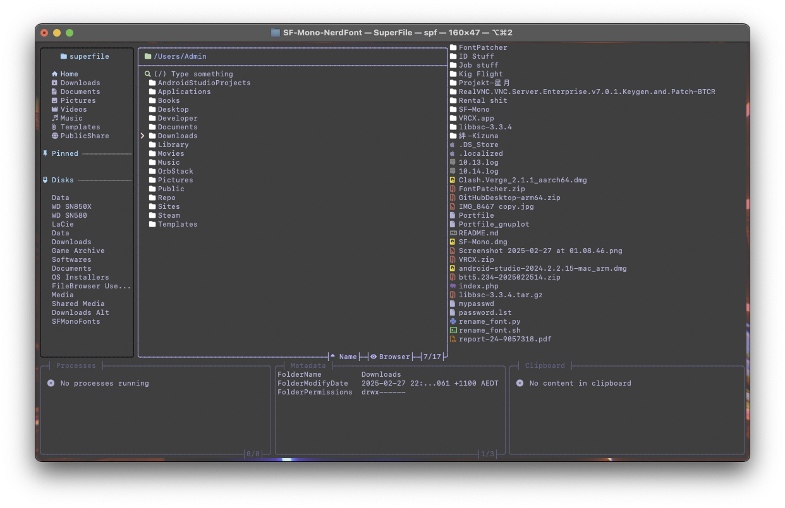

# SF-Mono-Nerd-Font

Apple's SF Mono font patched with [the Nerd Fonts patcher](https://github.com/ryanoasis/nerd-fonts#font-patcher) [Docker Image](https://hub.docker.com/r/nerdfonts/patcher), with every symbol groups patched in (`--complete`). The screenshot is a showcase the new glyphs using SuperFile.

Original font's copyright belongs to Apple Inc.
